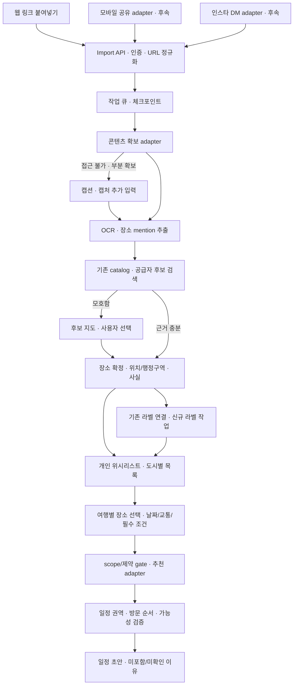

# SPEC-101: 인스타 공유 게시물의 장소 추출·도시별 저장·추천 연결 설계

- 상태: Draft
- 작성일: 2026-10-05
- 최종 수정일: 2026-10-05
- 관련 이슈: 인스타에서 발견한 장소를 개인 여행 후보로 저장하고 추천·일정 입력으로 연결
- 관련 문서: [문서 색인](README.md), [아키텍처](architecture.md), [데이터 계약](data_contracts.md), [안전·개인정보](safety_privacy.md), [평가](evaluation.md), [CCU-MMR](ccu_mmr_algorithm_draft.md)
- 관련 코드: 연결 대상 `map-ui/app.js`, `map-ui/ccu-mmr.js`, `scripts/build_map_ui_data.mjs`, `config/kakao_place_label_contract.v1.json`, `config/place_type_taxonomy.v1.json`. 승인된 초기 로컬 구현은 `server/instagram-import/`와 [SPEC-102](spec_102.md)에서 관리한다.
- 선행 SPEC: [SPEC-022](spec_022.md), [SPEC-078](spec_078.md)

> 전체 목표 시스템의 설계 초안이다. 아래 운영 API·테이블·개인 저장·추천/일정 정책은 계획이며, 초기 웹 링크 → 사진/OCR → 기존 스냅샷 메타데이터·라벨 연결의 실제 로컬 구현은 [SPEC-102](spec_102.md)가 정본이다. 개별 게시물의 접근 성공이 일반적인 자동 수집 성공을 보장하지 않는다.

## 배경

사용자는 인스타 링크에서 게시물 속 장소를 찾아 위치·도시별로 저장하고, 기존 라벨링 체계에 맞게 정리해 여행 추천과 일정 생성에 사용하려 한다. 복수 장소, 모호한 위치, 장거리·일정 충돌도 처리해야 한다.

### 사실

- 사용자 확정: 첫 입력은 웹 링크 붙여넣기. 모바일 공유와 인스타 DM도 같은 처리 흐름으로 확장 가능해야 한다.
- 사용자가 `https://www.instagram.com/p/DdvUunhprFx/`의 캡처를 제공했다. 이미지에는 「10월에 가기 좋은 제주도 대표 관광지 10곳」과 번호별 장소 10개가 보인다.
- 2026-10-05 링크 조회는 도구에서 `Online fetch throttled`로 실패했다. 원 캡션·전체 캐러셀·게시 시각·위치 태그는 확인하지 못했다. 이 도구의 실패를 모든 사용자의 인스타 장애로 일반화하지 않는다.
- 같은 날 재확인: Codex in-app 브라우저에서 원 공유 URL과 정규화 URL 모두 로그인 없이 게시물 이미지·캡션을 열었다. 가입 안내를 닫은 뒤 첨부한 것과 같은 관광지 10곳 이미지를 확인했다.
- 저장소 작업 환경의 비로그인 Python `urllib.request.urlopen` GET도 HTTP 200을 반환했고, HTML의 `og:title`·`og:description`에 캡션, `og:image`에 CDN 대표 이미지 URL이 있었다. 웹 조회 도구 실패와 브라우저/직접 HTTP 성공을 구분한다. 당시 캐러셀은 미검증이었고 후속 코드 검증은 SPEC-102에 기록한다. 운영 서버 IP·장기 반복 요청의 성공률은 미검증이다.
- 캡션은 「제주 관광지 참고하세요」와 제주/여행/제주도 해시태그이며 장소 10개 이름은 이미지 안에 있다. 이 사례에는 이미지 OCR/시각 추출이 필요하다. 대표 이미지 URL 존재만으로 전체 미디어 확보·장기 저장 허용을 확정하지 않는다.
- 브라우저 도구를 제외한 코드 진단: Python 표준 HTTP GET → HTMLParser의 `og:image` → CDN HTTP GET으로 이미지 다운로드와 Pillow 디코딩에 성공했다(HTTP 200, image/jpeg, 80,793 bytes, 640×640). 실제 파일은 관광지 포스터의 일부가 잘린 미리보기였다. 따라서 링크/이미지 접근은 가능하지만 이 경로만으로 장소 10개 전체를 추출할 수 있다고 판정하면 안 된다.
- 추가 코드 진단: Instaloader 4.15.3의 `Post.from_shortcode(context, "DdvUunhprFx")`로 비로그인 게시물 메타데이터를 받고 `Post.url`을 HTTP 다운로드했다. `GraphImage` 1장, HTTP 200, JPEG 391,495 bytes, 1440×1798이며 Pillow 디코딩·전체 화면의 관광지 10개 시각 확인을 통과했다. 사용자 브라우저·로그인 쿠키 없이 실행했다. 인스타가 제공한 전체 프레임 이미지이며 업로드 전 파일과 바이트 단위 동일성은 검사하지 않았다.
- 기존 장소 번들에는 해당 명칭에 대응하는 후보와 24+17축 데이터가 있다. 로컬 스냅샷의 후보 조회 결과이며 최신 정보 확인이나 온라인 자동 식별 검증은 아니다.
- 후속 캐러셀 `DEhnuo1KmAd`도 코드로 확인했다. GraphSidecar 9개 중 사진 8장 모두 1080×1350 JPEG 다운로드·decode에 성공했고 영상 1개는 미처리다. 이를 조건으로 사용자가 구현을 요청했으며, API 키 없이 로컬 OCR로 진행하도록 확정했다. 실제 추출·메타데이터·기존 라벨 연결 검증은 SPEC-102를 따른다.
- 문서와 코드에는 정적 추천·근사 일정 실험이 있다. 운영용 게시물 수집·개인 위시리스트·추천 API·실제 이동시간 기반 최적화는 미구현이다.

### 결정·가정·미결정

| 구분 | 내용 |
|---|---|
| 사용자 확정 | 웹 링크 입력 우선, 모바일 공유·DM 확장 |
| 검증된 기술 경로·설계 제안 | 예시 링크의 전체 이미지를 확보한 Instaloader adapter를 첫 acquisition 구현 후보로 채택. 운영 안정성은 별도 검증 |
| 설계 제안 | 채널 → 콘텐츠 확보 → 추출 → 식별 → 메타데이터·라벨 → 개인 저장 → 추천·일정의 독립 단계 |
| 설계 제안 | 저장한 장소는 기본 선호 후보. 필수·선호·제외는 여행별 사용자 선택 |
| 가정 | 국내 공통 구조를 설계하고 제주 자료로 먼저 검증. 지역 출시 범위는 미확정 |
| 미결정 | 인스타 확보·저장 허용 경로, 인증, 지역 확대, 이동시간 제공자, 품질 임계값 |

### 현재 구현 범위 — 사용자 확정

2026-10-05 사용자는 우선 「메타데이터 확인·기존 라벨 연결」까지만 구현한다고 범위를 정했다. 현재 목표 흐름은 웹 링크 → 내용 확보 → 장소 추출 → 위치/동일성·메타데이터 확인 → 기존 장소/라벨 연결 결과다. 개인 위시리스트·추천·일정·신규 라벨 생성·모바일 공유/DM 구현은 이후 범위이며 아래 전체 설계에는 계획으로 남긴다.

사용자가 이어서 브라우저 도구의 수동 열람이 아니라 링크 하나를 받은 서버 코드가 이미지를 확보해 처리하는 구조를 요청했다. 현재 구현 목표는 도구 세션에 의존하지 않는 acquisition/downloader/extractor 모듈이며, 브라우저 도구 열람 성공은 해당 모듈 구현 완료의 근거가 아니다.

직접 확인한 링크 접근 결과를 우선 기록했다. 접근 가능한 예시 하나를 반복 수집의 안정성·이용 허용 근거로 간주하지 않는다. 범위가 확정되었어도 미검증 계약·임계값이 남으므로 전체 SPEC 상태는 Draft다.

초기 단계의 구현 계약·승인 기준과 실제 결과는 별도 [SPEC-102](spec_102.md)에 분리했다. 이 문서의 운영·개인 저장·추천/일정 목표를 초기 로컬 동작으로 간주하지 않는다.

## 목표

- 링크·캡처에서 여러 장소를 각각 근거가 있는 후보로 만들고 기존 장소와 연결한다.
- 사용자별 도시 목록과 공용 장소 사실을 분리한다.
- 기존 41축·유형·제약을 재사용하고 식별·라벨·랭킹·일정 준비 상태를 구분한다.
- 접근 실패, 부분 성공, 동명이점, 장거리·일정 충돌의 해결 흐름을 정한다.
- 후속 구현 SPEC에 옮길 계약·검증 기준을 남긴다.

## 비목표

- 본 전체 설계에서 운영 수집 서버·온라인 DB·앱·DM 봇 구현·배포. 초기 로컬 서비스는 SPEC-102 범위다.
- 임의 인스타 URL에서 항상 전체 원문 확보, 저장 목록 전체 동기화, 로그인 쿠키 수집·접근 제한 우회
- 사진만으로 이름 없는 장소의 좌표 확정
- 일반 음식점·해외 장소의 기존 제주 41축 자동 편입
- 예약·결제, 사용자 취향 자동 변경, 시간대별 일정의 실행 가능성 보장

## 요구사항

- `REQ-001`: 첫 채널은 웹 링크 입력이며 모바일 공유·DM adapter는 공통 제출 계약을 사용한다.
- `REQ-002`: URL을 검증·정규화하고 플랫폼 게시물 키·사용자별 제출·처리 작업을 분리한다.
- `REQ-003`: 서버 코드가 콘텐츠·이미지를 확보하고 방식·시각·권한 정책·coverage를 기록한다. 다운로드 성공과 추출 가능한 전체 이미지 확보를 구분하며 잘린 미리보기·낮은 품질·접근 실패 시 보완 입력으로 전환한다.
- `REQ-004`: 복수 장소를 별도 mention으로 추출하며 이름·지역 힌트·본문/이미지 위치·주장 근거를 보존한다.
- `REQ-005`: 기존 crosswalk·공급자 ID와 이름·주소·지역·좌표·지점·구간을 비교한다. 이름만으로 자동 확정하지 않는다.
- `REQ-006`: 내부 canonical ID와 공급자 ID를 분리하며 모호한 mention에 임의 좌표·지점을 채우지 않는다.
- `REQ-007`: 확인된 위치로 국가·행정구역·도시를 분류하고 도시와 일정 이동 권역을 분리한다.
- `REQ-008`: 메타데이터는 필드별 출처·확인 시각·충돌·freshness를 보존하며 변동 사실을 별도로 관리한다.
- `REQ-009`: 기존 검증 라벨은 버전을 유지해 연결한다. 신규 장소는 사실 조사 → 원자·상황 라벨 → 파생축 계산 → 검증 순서다.
- `REQ-010`: 기존 41축·척도·출처 계약을 지키고 unknown과 N/A를 구분한다. 추천 문구로 빈 축을 확정하지 않는다.
- `REQ-011`: 개인 위시리스트와 공용 catalog를 분리한다. 사용자별 동일 장소는 하나이며 발견 근거는 여러 개 연결한다.
- `REQ-012`: 저장·식별·라벨 준비·랭킹 자격·일정 준비를 구분하며 준비 부족으로 저장 장소를 삭제하지 않는다.
- `REQ-013`: 필수·선호·제외는 여행별 의도다. 저장만으로 필수 방문이나 전체 취향 변경을 추론하지 않는다.
- `REQ-014`: 기존 엔진 adapter는 제주·scope·legacy ID·41축·유형·제약을 검사하며 기존 정책을 우회하지 않는다.
- `REQ-015`: 일정은 필수 제약을 먼저 처리하고 장거리·일수·유형·운영정보 충돌을 이유 코드로 반환한다.
- `REQ-016`: 모든 선택 장소의 포함·보류·제외·미확인 상태를 반환하고 필수를 조용히 제거하지 않는다.
- `REQ-017`: 중복·동시 작업·재시도·취소를 멱등 처리하고 장소별 부분 성공·실패를 보존한다.
- `REQ-018`: 사용자 접근 제어·최소 보관·삭제 전파·서버 비밀 보호·URL/파일 검증·외부 콘텐츠 격리를 적용한다.
- `REQ-019`: 입력 digest, snapshot, 모델·프롬프트·식별·지역·추천·일정 정책 버전과 실제 근거를 추적한다.
- `REQ-020`: 독립 정답셋의 복수 장소·모호성·중복·장거리·실패 사례와 기존 엔진 회귀로 출시 여부를 판단한다.

## 입력과 출력 — 계획

```text
ImportSubmissionV1 {
  schema_version: "social-place-import-v1"
  submission_id: UUID                  # 서버 생성
  owner_id: opaque string              # 인증 principal에서 서버 결정
  channel: web_paste | mobile_share | instagram_dm
  source_url: HTTPS URL?
  user_text: string?
  asset_ids: UUID[]                    # 사용자 소유 업로드만
  input_revision: positive integer
  idempotency_key: string
  received_at: ISO 8601 UTC
}

ImportResultV1 {
  submission_id, job_id, input_revision, status
  content_coverage: { caption, image_count, carousel, video, location_tag }
  counts: { extracted, resolved, needs_review, not_found, saved_places }
  mentions: [{ mention_id, observed_name, evidence_refs, resolution,
               candidates, place_id?, wishlist_item_id?, readiness }]
  warnings: [{ code, mention_ids, next_action }]
  provenance: { input_digest, extractor_version, resolver_version,
                region_policy_version, metadata_snapshot_ids,
                label_snapshot_ids, processed_at }
}
```

- URL·텍스트·이미지 중 하나 이상 필요하다. 웹 첫 진입은 URL이며 보완 입력은 같은 제출의 새 revision으로 기록한다.
- owner·권한·confidence는 body 값을 신뢰하지 않는다. 운영 계정 또는 만료·삭제가 있는 비공개 workspace 인증 방식은 구현 전에 정한다.
- 좌표는 WGS84 `[longitude, latitude]`, 거리는 m, 이동·체류는 min. 시각은 UTC 저장·목적지 시간대 표시, 여행 날짜는 IANA timezone과 함께 보존한다.
- 다른 mention이 같은 장소를 가리킬 수 있으므로 추출 mention 수와 저장 장소 수는 별도로 계산·표시한다.
- counts는 0 이상의 정수다. coverage의 caption/location_tag는 `available|missing|unknown`, image_count는 0 이상의 정수, carousel은 `complete|partial|unknown`, video는 `not_processed|partial|complete|absent|unknown`이다. source URL·place ID·선택 근거가 없으면 명시적 null 또는 상태를 사용한다.

## 전체 목표 설계 — 계획

이 절의 운영 계약은 계획이다. 구현된 초기 로컬 단계와의 차이는 SPEC-102를 따른다.

### 1. 컴포넌트



AI는 mention·근거·라벨 초안을 제안한다. 좌표·ID 확정, 파생축, 저장 무결성, 제약·일정 검증은 결정적 서버 로직이 담당한다. 초기 구현은 별도 import API/worker, 관계형 DB, 비공개 임시 asset 저장소의 모듈형 구성을 제안한다. 백엔드 프레임워크·DB 제품은 미결정이며 분산 서비스 배포는 초기 필수 조건이 아니다.

### 2. 채널과 URL

- 예시 URL은 `https://www.instagram.com/p/DdvUunhprFx/`로 정규화하고 `platform=instagram, post_key=DdvUunhprFx`를 분리한다. query·fragment는 게시물 동일성에 사용하지 않는다.
- host·scheme·포트·게시물 경로를 파싱해 허용 형식만 받는다. 단축 URL은 허용 목록·redirect 검증이 있는 adapter에서만 해석한다.
- 모바일 adapter는 OS 공유의 URL·텍스트·asset을 공통 계약으로 변환한다. 공유 버튼이 원 이미지 전체를 전달한다고 가정하지 않는다.
- DM adapter는 공식 webhook·발신자 검증·이벤트 중복 제거 후 우리 사용자와 연결된 발신자만 수신한다. 링크/attachment 필드는 실제 payload 확인 후 결정한다. DM 수신은 원 게시물 전체 접근 권한이 아니다.
- 첫 버전은 DM 수신/자동 답장을 구현하지 않는다. 추후 채널을 추가해도 downstream 로직은 공통으로 사용한다.

### 3. 콘텐츠 확보와 coverage

| 경로 | 용도 | 실패 시 |
|---|---|---|
| Instaloader adapter — 예시 코드 진단 성공 | 공개 게시물 shortcode → 캡션·미디어 메타데이터 → 전체 이미지 URL. 예시의 1440×1798 다운로드 검증 | metadata 오류·로그인 요구·403/429를 구분하고 제한된 재시도/다른 adapter·보완 입력 |
| 검증된 공식 API·허가된 공급자 | 허용 계정·범위의 캡션/미디어 | 권한·범위·쿼터 오류와 보완 입력 |
| 사용자 캡션·캡처 | 사용자가 준 자료에서 후보 추출 | 읽기 어려운 부분만 추가 입력 |
| 원문 링크·허용 임베드 | 사용자 원문 확인 | 원문 링크 유지 |

임의 URL, oEmbed, 로그인 연동만으로 추출용 원문 확보를 보장하지 않는다. **oEmbed는 장소 분석·파생 저장의 기본 수집 경로로 선정하지 않는다.** 표시용 접근과 분석·보관 허용 범위는 공식 문서에서 각각 검증해야 한다. Meta 원문 조회가 실패해 최신 API 권한·토큰·사용 범위는 미검증이다.

snapshot에는 캡션 유무·확보 이미지 수/순서·캐러셀 `complete|partial|unknown`·영상 처리 범위·위치 태그 coverage를 둔다. 한 장이면 “첨부 이미지에서 10곳”으로 표현하며 게시물 전체 분석으로 과장하지 않는다. 영상 OCR/음성 분석은 후속 범위로 기본 `not_processed`다.

접근 불가를 장소 미발견으로 기록하지 않는다. 원문 링크와 제출을 보존해 캡처·캡션을 추가할 수 있다. 새 입력은 새 snapshot/revision이며 기존 성공 결과를 덮어쓰지 않는다.

### 3.1 서버 코드의 이미지 확보·처리 구조 — 계획

```text
POST /travel/api/imports {url}
  → worker.acquire_post(url)
  → worker.download_assets(media_candidates)
  → worker.validate_media(assets, coverage)
  → worker.extract_mentions(caption, usable_assets)
  → worker.resolve_places(mentions, catalog, providers)
  → worker.attach_existing_labels(resolved_places)
  → metadata + label_snapshot_refs + unresolved + provenance JSON
```

| 모듈 | 입력 → 출력 | 책임 |
|---|---|---|
| acquisition adapter | canonical URL → caption·media candidates·coverage | 원 게시물 콘텐츠와 미리보기 구분 |
| image downloader | 허용된 후보 URL → 비공개 image asset | 스트리밍 한도·timeout·redirect/host/IP 검증 |
| image validator | 실제 바이트 → 형식·크기·품질·잘림 상태 | URL 확장자보다 MIME·magic·디코더를 검사 |
| mention extractor | 캡션+사용 가능한 이미지 → 근거 연결 mention[] | OCR·시각 모델, 전체 확보 여부와 추출 범위 보존 |
| place resolver | mention+기존 catalog/검색 → metadata 후보/확정 | 별칭·지점·주소·지역 교차 확인 |
| label linker | resolved legacy/canonical ID → 기존 snapshot refs | 새 라벨을 생성하지 않고 정확한 기존 ID로 연결 |

**확보 전략:**

1. URL 검증·정규화 후 shortcode를 Instaloader adapter에 전달한다. 첫 구현 후보는 검증한 4.15.3이다. `Post.from_shortcode`의 메타데이터를 읽고 단일 사진은 `Post.url`, 캐러셀 사진은 `get_sidecar_nodes()`의 각 `display_url`을 다운로드 후보로 반환한다. 영상은 사진으로 처리하지 않는다. 작성자·댓글은 결과 계약에 넣지 않으며 자동 파일 저장 기능도 사용하지 않는다.
2. downloader가 adapter 반환 URL을 즉시 다운로드하고 디코더·픽셀/크기 한도·이미지 순서·미디어 수/coverage를 검증한다. 예시에서는 단일 전체 프레임 확보가 확인됐으며 캐러셀·영상·다른 게시물·반복 호출은 미검증이다. 전체 이미지라도 글자가 불명확하면 추출 결과에 unknown을 남긴다.
3. Instaloader 실패 시 검증된 공식/허가된 공급자 등 교체 adapter를 사용할 수 있다. 가벼운 HTTP GET의 OG·JSON-LD 파싱은 보조 경로다. `og:image`는 preview 후보로 기록하며 단독으로 전체 미디어라고 승격하지 않는다. 선택적 Playwright 서버 렌더링도 후보지만 실제 인스타 동작은 미검증이며 기본 경로로 확정하지 않는다.
4. Instaloader가 반환한 CDN URL의 서명·변환 query를 임의로 제거하지 않는다. 예시의 전체 이미지 성공은 라이브러리가 제공한 다른 URL을 그대로 받은 결과다. 만료 CDN 주소를 영구 장소 ID로 저장하지 않으며 작업 중 필요한 asset으로 즉시 확보한다.
5. 전체 이미지가 확보되지 않으면 `partial_media`/`needs_input`을 반환한다. 잘린 부분에서 찾은 장소만 근거와 함께 제안할 수 있지만 10개 전체 추출 성공으로 표시하지 않는다.

Instaloader·HTML·공식 공급자·선택적 서버 렌더링을 교체 가능한 adapter로 분리한다. 기본 모듈 계약을 유지하면 나머지 추출·식별·라벨 연결 코드를 바꾸지 않고 교체할 수 있다. Instaloader는 Meta 공식 API가 아닌 외부 라이브러리이므로 버전과 확보 경로를 기록하고 외부 인터페이스 변경을 단계 실패로 처리한다. 코드 사용법은 [Instaloader 모듈 공식 문서](https://instaloader.github.io/as-module.html), 미디어 속성은 [Post·PostSidecarNode 문서](https://instaloader.github.io/module/structures.html)를 기준으로 확인했다.

검증한 최소 코드 경로는 다음과 같다. 코드 조각은 진단 예시이며 운영용 URL/다운로드 제한·오류 처리 전체를 구현한 수집기가 아니다.

```python
import urllib.request
import instaloader

loader = instaloader.Instaloader(
    quiet=True, sleep=False, max_connection_attempts=1,
    request_timeout=20, download_comments=False, save_metadata=False,
)
post = instaloader.Post.from_shortcode(loader.context, "DdvUunhprFx")
image_urls = (
    [node.display_url for node in post.get_sidecar_nodes() if not node.is_video]
    if post.typename == "GraphSidecar" else ([] if post.is_video else [post.url])
)
with urllib.request.urlopen(image_urls[0], timeout=20) as response:
    image_bytes = response.read(16 * 1024 * 1024 + 1)
# 실제 진단에서는 바이트 상한 확인, Pillow decode·verify, 시각 확인까지 수행했다.
```

```text
ImageAssetV1 {
  asset_id: UUID
  origin: instaloader_post | og_preview | rendered_post | authorized_provider | user_upload
  storage_key: private opaque key
  sha256: string
  mime_type: verified string
  width_px, height_px, byte_size: positive integer
  source_image_order: nonnegative integer?
  frame_coverage: complete | cropped | unknown
  extraction_quality: usable | insufficient | unknown
  collected_at: ISO 8601 UTC
}
```

단순 해상도·가로세로 비율만으로 잘림/완전성을 확정하지 않는다. 게시물 원본/렌더링 정보와 시각 검증을 결합하고 증거가 부족하면 unknown이다. 파일 decode 성공도 OCR 정확도나 전체 확보의 근거가 아니다. 예시 URL의 다운로드 파일은 직접 시각 확인해 cropped로 판정했다.

downloader는 공개 OG에서 경로가 HEIC처럼 보여도 실제 응답이 JPEG일 수 있음을 고려한다(이번 사례도 해당). HEIC/AVIF 지원·JPEG/PNG 정규화는 실제 사용 decoder와 fixture로 구현 전에 고정한다. OCR 실패·환각을 해결하기 위해 게시물에 없는 문장을 만들어 라벨링에 넣지 않는다.

첫 응답은 job ID이며 UI는 서버 결과를 조회한다. worker는 이미지 asset → mention evidence → 장소 metadata → 기존 label ref까지 결과를 체크포인트로 남긴다. 아직 온라인 DB·endpoint·worker·OCR 연동 코드는 만들지 않았다.

### 4. 장소 mention 추출

1. 캡션·위치 태그·제공 이미지 OCR를 각각 근거 조각으로 만든다.
2. 번호·제목·사진/본문 블록을 연결해 복수 장소를 분리하고 정규화 전 이름을 보존한다.
3. 이름·별칭·지역/주소 힌트·지점/구간·게시자 주장·계절 맥락을 제한된 JSON으로 추출한다.
4. 이미지 순번+bbox 또는 text span으로 근거를 연결한다. 근거 없는 주소·좌표·운영정보 출력은 거부한다.
5. 같은 장소 반복 언급은 근거를 합치되 다른 지점/구간은 합치지 않는다. 최종 동일 ID는 저장에서 중복 제거한다.

추출 confidence·식별 score·라벨 confidence는 서로 다르며 모델 자체 confidence를 성공 확률로 표시하지 않는다. 이름 없는 사진은 `unresolved_visual`로 보관하고 장소명 추가를 받는다. 게시물의 순위/번호를 방문 순서로 해석하지 않는다.

### 5. 식별과 canonical 장소

기존 catalog·crosswalk를 먼저 조회한다. 동일성 확정 시 기존 snapshot을 연결하며 조사/라벨을 중복 생성하지 않는다. 신규·미일치 후보만 외부 검색한다.

- 후보 비교: 공급자 ID, 전체 이름·별칭·지점, 주소·지역, 알려진 좌표와 거리, 유형, 상위 시설·코스 구간.
- 지역 힌트는 검색에 쓰되 첫 후보/가까운 후보를 무조건 확정하지 않는다. 지역 충돌은 별도로 표시한다.
- `resolved`는 식별 기준 통과 또는 명시적 사용자 선택이다. 사용자 선택은 최신 운영 확인·라벨 승인이 아니다.
- score·자동 확정 threshold·1/2위 차이·거리 오차는 독립 정답셋으로 정한다. 임의 수치를 정확도로 표시하지 않는다.
- 동명이점·입구·부속 시설·경로 혼동은 `needs_review`: 이름·주소·지도·원문 근거로 후보 선택/거부.
- 후보 없음은 `not_found`, 공급자 실패는 `lookup_failed`이며 통계를 구분한다.

새 canonical ID는 공급자 독립 UUID다. `PlaceProviderLink(provider, provider_place_id)`로 여러 원본을 연결한다. 기존 TourAPI ID는 legacy link로 유지한다. 공급자 내 한 ID는 한 canonical 대표에만 연결하고 부속 시설·구간은 `PlaceRelation`에 보존한다. merge는 감사 기록·alias·참조 재연결을 요구한다.

선형 해안길·도보 코스는 `geometry_kind=route`다. 실제 입구/접근점 확인 전 대표점·중심점을 이동 목적지로 확정하지 않는다.

### 6. 사실과 도시 분류

국내 후보 검색·좌표·행정구역 확인은 Kakao Local adapter를 우선 검토한다. 공식 문서는 키워드 검색의 이름·주소·좌표·카테고리·장소 URL과 좌표의 행정/법정동 변환을 설명한다. 영업시간·체류시간이 제공된다고 확대 해석하지 않는다. [Kakao Local 공식 문서](https://developers.kakao.com/docs/ko/local/dev-guide)

| 묶음 | 필드 |
|---|---|
| 식별 | 이름·별칭·공급자 ID·source URL·시설 관계 |
| 위치 | longitude, latitude, 좌표 source/정확도 상태, geometry/access point, timezone |
| 분류 | 원본 카테고리, 서비스 scope·대표 유형·각 정책 버전 |
| 도시 | country_code, admin_path/code, city_key/display_name, region_policy_version |
| 사실 | key/value/unit, source_id, checked_at, valid_from/to, dynamic, status |
| 일정용 | 체류시간 범위, time window, 예약·접근 조건, 각각 근거 또는 unknown |

도시는 해시태그가 아니라 식별한 장소의 주소·좌표로 분류한다. `city_key`는 versioned 서비스 분류다. 시·군·자치구·광역시 구조가 다르므로 공급자 region 2depth를 그대로 도시로 쓰지 않는다. 제주시/서귀포시는 분리하고 제주 여행권은 별도 destination group으로 연결할 수 있다.

도시 key는 저장 탐색, `travel_cluster_id`는 여행별 배치에 쓴다. 같은 도시라도 멀고 다른 도시라도 가까울 수 있다. 권역은 교통·시작/종료점·여행일·정책에 따라 계산하며 장소 영구 속성이나 고정 동/서부 문자열로 저장하지 않는다.

변동 사실은 출처·시각뿐 아니라 field별 freshness/validity 정책이 필요하다. 충돌은 `conflicting`·확인 필요로 유지한다. 국외·미지원 지역의 저장 구조는 준비하되 출시 자격은 scope gate로 제한한다.

### 7. 41축 라벨 연결

축 정의와 파생 공식의 정본은 [SPEC-022](spec_022.md), [데이터 계약](data_contracts.md), `config/kakao_place_label_contract.v1.json`이며 이 문서에 복제하지 않는다.

- 24 선호축 = 원자 18+파생 6, 상황 17축 = 동행 5+월 12. 척도는 `0/0.25/0.5/0.75/1`.
- 동일 장소의 기존 검증 label snapshot을 버전 그대로 연결한다. 캡처 홍보 문구로 기존 라벨을 덮어쓰지 않는다.
- 신규는 확인된 사실·원 출처 → 원자/상황축 제안 → 파생 재계산 → provenance/척도 검증. 직접 근거와 추론을 구분하며 근거 없는 극단값을 금지한다.
- “10월에 좋다”는 `source_claim(month=10)`이다. 다른 달 부적합·올해 개화/단풍·동행 적합도·사용자 여행 날짜를 확정하지 않는다.
- raw unknown은 provenance에 보존한다. 현 소비 계약이 unknown을 받지 못하면 `labels_pending`으로 두고 ranker에 넣지 않는다. N/A는 `state=not_applicable, value=null`.
- 제주 기후 prior·제주 지역성 정의를 다른 지역에 자동 적용하지 않는다. 확대에는 region-aware 정의·기후·평가의 후속 SPEC이 필요하다.
- 일반 음식점·미지원 scope·private/closed·부속 시설은 저장과 랭킹 자격을 구분한다. 엔진 편입을 위해 억지 완전 벡터를 만들지 않는다.
- 대표 유형은 `config/place_type_taxonomy.v1.json`을 따르고 원 분류를 보존한다. 새 유형·정책 변경은 별도 범위다.

### 8. 저장 모델

| 엔터티 | 내용·관계 |
|---|---|
| PostRef | platform+post_key 유일 식별·canonical URL. 사용자 원문 없음 |
| ImportSubmission / ImportJob | owner별 입력·revision, stage·attempts·fingerprint·lease·버전·오류 |
| ContentSnapshot / EvidenceFragment | 제출별 방식·coverage·digest·시각·보관 정책, OCR bbox/text span·주장 |
| PlaceMention / ResolutionCandidate | snapshot별 mention, 후보·선택·식별 이유·상태 |
| Place / PlaceProviderLink / PlaceRelation | canonical ID, 공급자/legacy ID, 별칭·시설/구간 관계 |
| PlaceFact / PlaceLabelSnapshot | 사실·출처·유효기간, 변경 불가한 버전 라벨 |
| WishlistItem / WishlistEvidence | owner별 장소 또는 unresolved mention, 여러 발견 근거 |
| TripPlaceIntent | 여행별 place의 required/preferred/excluded·사용자 결정 |
| ItineraryRun / ItineraryDisposition | 고정 입력·snapshot·정책, 모든 선택 장소의 결과/이유 |

- UNIQUE: platform+post_key, provider+provider_place_id, owner+place_id(확정 장소만). unresolved는 owner+mention으로 중복 제어한다.
- PostRef가 같아도 개인 캡처·텍스트·위시를 공유 cache로 노출하지 않는다. 공용 catalog 승격은 허용된 사실의 별도 검증 절차다.
- 식별·위시·발견 연결을 트랜잭션+UNIQUE/upsert로 기록한다. 다른 게시물에서 발견해도 장소는 하나, 근거는 N개다.
- 인덱스: owner/city/status, provider/ID, job/status, fact/place/key/time, label/place/version.
- 온라인 작업은 기존 원본·SQLite·지도 bundle을 직접 수정하지 않는다. canonical↔legacy crosswalk를 추가한다.
- 추천 입력은 snapshot을 고정한다. 배경 갱신으로 과거 일정 근거를 조용히 교체하지 않고 재검증 필요를 표시한다.

### 9. 상태와 재시도

```text
job: queued → acquiring → extracting → resolving → persisting
     → completed | partial
     ↘ awaiting_input | retry_wait | failed | cancelled

mention: extracted → candidates_ready → resolved
                        ↘ needs_review | not_found | lookup_failed | rejected

readiness: saved_unresolved | saved_resolved | labels_pending
           | rankable_experiment | blocked | unsupported_scope
```

completed는 import 결과 저장 완료이며 일정 준비를 뜻하지 않는다. 해결한 장소는 바로 저장하고 일부 모호한 것은 partial로 남긴다. 라벨 보강은 별도 작업이며 느린 한 곳이 전체 저장을 막지 않는다.

채널 이벤트 키, owner별 HTTP 멱등 키, 단계 fingerprint를 구분한다. fingerprint는 revision/digest+단계+정책/모델 버전이다. 같은 키·같은 요청은 기존 job, 같은 키·다른 payload는 409다. 입력/정책 변경은 새 작업을 만들고 체크포인트를 재사용한다.

일시 실패만 제한 재시도·지수 백오프·지터·Retry-After로 처리한다. 권한 거절·삭제·unsupported는 재시도 루프에 넣지 않는다. worker lease+원자 commit과 삭제/취소 tombstone으로 중복·지연 응답의 데이터 부활을 막는다. 한도·쿼터·비용 정책은 구현 SPEC에서 정한다.

### 10. 사용자 흐름과 API 경계

1. 링크 입력 → 단계·처리 건수 표시.
2. 콘텐츠 부족 → 캡션/캡처/장소명 추가. 이미 해결한 곳은 유지.
3. 추출 결과 → 주소·도시·지도·원문 근거, 애매한 것만 선택/수정/거부.
4. 저장 → 도시별 가고 싶은 곳과 미확인 목록.
5. 여행 만들기 → 후보·날짜·교통·동행·기존 취향, 여행별 필수/선호.
6. 일정 초안 → 일별 권역, 미포함/미확인 이유, 날짜/의도 변경·다른 여행으로 남기기.

| 계획 API | 책임 |
|---|---|
| POST /travel/api/imports | 인증·검증, 202+job ID·멱등 |
| GET /travel/api/imports/{id} | owner별 상태·coverage·결과 |
| POST /travel/api/imports/{id}/revisions | 보완 입력의 새 revision |
| POST /travel/api/imports/{id}/mentions/{mentionId}/resolution | 후보 선택/보류/거부·revision 검사 |
| GET /travel/api/wishlist?city_key=... | 도시·상태별 개인 목록 |
| DELETE /travel/api/wishlist/{id} | 개인 위시·발견 연결 삭제 |
| DELETE /travel/api/imports/{id} | 원문·asset·개인 근거 삭제. 별도 근거의 위시는 보존 |
| POST /travel/api/itinerary-drafts | 여행 의도·adapter·가능성/미확인 결과 |

비공개 업로드 검증 경로는 별도로 둔다. 임의 파일 URL을 import API에서 fetch하지 않는다. 기존 피드백 API/DB를 개인 저장의 인증·저장 기반으로 간주하지 않는다.

### 11. 추천·일정과 장거리

개인 저장 → 여행 후보 → place-fit → 일정 배치를 분리한다. 발견 출처 수·인기도·저장만으로 41축·MBTI를 변경하지 않는다.

현 엔진 adapter는 canonical↔TourAPI ID, 제주 지원 지역·단일 intent·41축·대표 유형·활성 제약을 검사한다. required만 기존 필수 입력으로 보낼 수 있다. preferred 위시 우선순위는 별도 versioned 선택 정책·평가가 필요하며 현 엔진에 있다고 가정하지 않는다. 미지원 장소도 개인 목록과 사유를 유지한다.

required 장소가 unresolved·labels_pending·미지원 scope이면 완성 일정 실행을 보류하고 `needs_input|needs_verification|unsupported_scope`를 반환한다. 준비된 일부 후보로 만든 결과를 모든 필수가 충족된 일정으로 표시하지 않는다. preferred의 누락은 disposition으로 설명한다.

| 상황 | 처리 제안 |
|---|---|
| 다른 도시/국가 | 각각 저장. 단일 목적지 밖은 알리고 다른 여행 또는 명시적 다도시 선택 |
| 같은 도시 장거리 | 이동시간으로 권역/날짜 분리. preferred 보류 시 이유 기록 |
| 필수 장거리·일수 부족 | 필수 보존, 충돌 집합·날짜/교통/의도 변경 제안 |
| 같은 유형 필수 집중 | SPEC-078 일일 상한에 맞춰 분리. 부족하면 충돌, 임의 완화 금지 |
| 섬·산·항공/선박 | 직선거리로 가능 판정 금지. 연결 교통 미확인이면 needs_verification |
| 좌표·입구·이동시간 부족 | 저장 유지·일정 unknown. 0분 보정 금지 |
| 휴무·폐쇄·행사 날짜 충돌 | 확인된 필수 제약 우선, 점수로 상쇄 금지 |

시간 기반 후속 일정기는 접근점·일별 시작/종료점·교통·체류 범위·운영/예약 window·이동시간 행렬을 받는다. 이동+체류+휴식 ≤ 하루 가용시간, time window·필수 포함·유형 상한을 검증하며 권역/도시간 이동일도 포함한다. 교통수단·조회시각·시간 범위는 trace에 기록한다.

기존 직선거리/capacity 방식은 `schedule_level=geographic_draft`다. 기존 feasible은 `geographic_feasibility`로 보존하고 `time_feasibility=unknown`과 구분한다. 탐욕적 배치 실패는 전역 불가능의 증명이 아니다. `solver_status=no_solution_found`와 검증된 제약 충돌을 구분한다.

모든 선택 장소에 included/deferred/excluded/unresolved와 이유·constraint·확인사항을 반환한다. 날짜·필수 여부를 사용자 결정 없이 완화하지 않는다.

### 12. 보안·개인정보·운영

- URL: allowlist·HTTPS·포트·DNS/IP·각 redirect 검증, private/loopback/link-local 차단. 모델 제안 URL 자동 fetch 금지.
- 이미지·캡션의 지시는 데이터이며 worker 권한·프롬프트·설정을 변경하지 못한다. 출력은 허용 schema로 검증한다.
- 파일 실제 형식·크기/픽셀 한도, 메타데이터 제거, 비공개 접근. 작성자·댓글 사용자·DM 전체 대화·사용자 GPS는 기본 수집하지 않는다.
- 비밀은 서버에 둔다. 외부 모델에는 필요한 조각만 보내고 owner/DM 발신자·개인 일정 전체는 제외한다.
- 보관 제안: 임시 원문은 최종 처리+24시간 또는 제출+7일 중 빠른 시점 삭제. 보완 중에도 7일 상한. 축소 근거는 장소명·bbox/span·source URL·digest·허용 최소 excerpt만.
- 위시는 사용자 삭제/계정 정책까지, 원문 없는 진단은 30일을 제안한다. 공급자 제한이 더 짧으면 우선한다. 이 숫자는 현재 운영 정책이 아니며 인증·휴면·모델 처리·약관과 함께 구현 전 확정한다.
- 삭제는 제출·원문·개인 근거·위시·job·개인 cache/외부 저장에 전파한다. 공용 검증 사실은 개인 연결 제거 후 보존 가능하다. 백업 삭제 유예·복구 tombstone도 출시 계약에 포함한다.
- 관측은 단계별 성공·접근불가·coverage·모호성·중복·latency/cost·미포함 사유. 원문·토큰·방문 이력은 로그에 기록하지 않는다.

## 예시 게시물 적용 — 캡처와 로컬 스냅샷

한 이미지의 장소명 10개를 읽고 `map-ui/data/jeju-places.js`를 읽기 전용으로 조회했다. 아래는 **연결 후보**이며 최신 주소·운영·동일성 외부 검증은 아니다. 이미지에서 좌표를 추출했다는 의미도 아니다. 후속 링크 진단에서는 게시물 캡션과 해시태그를 실제 확인했다.

| 번호 | 이미지 장소명 | 기존 연결 후보 | TourAPI ID | 로컬 도시 |
|---|---|---|---|---|
| 1 | 새별오름 | 새별오름 | 572973 | 제주시 |
| 2 | 한라산둘레길 천아숲길 | [한라산 둘레길 1구간] 천아숲길 | 2661848 | 제주시 |
| 3 | 산굼부리 | 산굼부리 | 126474 | 제주시 |
| 4 | 휴애리 자연생활공원 | 휴애리자연생활공원 | 322836 | 서귀포시 |
| 5 | 마노르블랑 | 마노르블랑 | 3080468 | 서귀포시 |
| 6 | 1100고지습지 | 1100고지습지 | 1861656 | 서귀포시 |
| 7 | 와흘메밀마을 | 와흘메밀마을 | 2905045 | 제주시 |
| 8 | 닭머르해안 | 닭머르해안길 | 2652545 | 제주시 |
| 9 | 항파두리 항몽유적지 | 제주 항파두리 항몽 유적 | 128050 | 제주시 |
| 10 | 9.81파크 | 9.81 파크 제주 | 2609373 | 제주시 |

- 흐름 점검: 이미지 → mention 10개 → 후보 10개 → 제주시 7·서귀포시 3. 실제 OCR/자동 식별기는 미구현.
- 천아 부분검색은 천아오름·천아숲길·낙천아홉굿마을을 함께 반환했다. 첫 결과는 정답이 아니며 전체 이름·유형·구간을 확인해야 한다.
- 1100 검색은 습지와 도로를 반환한다. 닭머르/항파두리는 표준 이름과 달라 alias/시설 확인이 필요하다.
- 10월 맥락의 연도·게시 시각은 미확인이다. 현재 개화·단풍·사용자 출발월을 확정하지 않는다.
- 후보 10개에 24축과 fit가 있다. 동일성 확정 후 재사용 가능하지만 제약·scope·최신성은 별도 검사한다.
- 새별오름·산굼부리는 현재 같은 mountain_oreum 유형이다. 둘 다 필수면 일일 상한을 고려한다. 10곳 저장이 모두의 단일 일정 편입을 뜻하지 않는다.
- 캡처 원본·작성자 정보는 저장소에 복사하지 않았다. 작은 본문에서 확실히 읽지 못한 문장은 사실로 옮기지 않았다.

## 예외와 폴백

| 코드 | 조건 | 처리 |
|---|---|---|
| invalid_source_url | host/형식 위반 | 거절·안내, 임의 fetch 금지 |
| content_unavailable / content_partial | 접근 불가/일부 확보 | 원문 유지·coverage·추가 입력 |
| no_place_mentions | 단서 부족 | 장소명 직접 입력 |
| ambiguous_identity | 지점/구간 모호 | 후보 선택·미확인 저장 |
| metadata_conflict | 출처/좌표 충돌 | 재검증·근거 보존 |
| labels_pending | 축/근거 부족 | 저장 유지·ranker 보류 |
| outside_trip_scope | 목적지/지원 범위 밖 | 다른 여행·다도시 선택 |
| required_constraint_conflict | 필수/일수/유형 충돌 | 필수 보존·변경 선택지 |
| travel_time_unknown | 경로/교통 미확인 | 지리 초안·실행 가능성 unknown |
| provider_retry_exhausted | 재시도 종료 | 부분 결과·단계 재개 |
| stale_revision | 오래된 보완/선택 | 409+현재 revision |

## 영향 범위

- 이번 변경: `docs/spec_101.md`, `docs/README.md`만. 상세 목표 설계의 정본은 이 SPEC이다.
- 향후 영역(경로 미정): import API/worker, 개인 DB/asset, provider·label·추천 adapter, 검토·도시 UI, 평가 fixture.
- 이번 마이그레이션 없음. 후속 canonical crosswalk 추가 시 원본·라벨·bundle을 in-place 교체하지 않는다.
- 현재 UI·엔진·피드백 API 동작 변화 없음. 개인 저장의 인증·보관/삭제 계약은 새로 필요하다.
- 이번 작업에서 캡처 원문 저장·외부 업로드를 수행하지 않았다.

## 승인 기준 — 구현 후 검증할 목표

| 승인 기준 | 요구사항 | 통과 조건 |
|---|---|---|
| `AC-001` | REQ-001~002 | 채널 fixture가 공통 계약, query 차이 URL은 같은 post key |
| `AC-002` | REQ-003 | 서버 이미지 다운로드와 decode·coverage 검사, 잘린 OG preview를 전체 확보로 오판하지 않음, 실패/부분에 보완 입력·무한 재시도 없음 |
| `AC-003` | REQ-004 | 예시의 독립 정답 mention 10개와 위치 근거 모두 보존 |
| `AC-004` | REQ-005~006 | 동명이점·부분문자열·입구/구간 오확정 없음 |
| `AC-005` | REQ-007 | 도시·좌표 순서·도시/동선 구분 검증 |
| `AC-006` | REQ-008 | 변동 사실의 출처·시각·freshness·충돌 보존 |
| `AC-007` | REQ-009~010 | 기존 재사용·축/척도/출처/파생·unknown/N/A 검증 |
| `AC-008` | REQ-011 | 동시 중복에도 owner별 장소 1개·근거 N개, 타 사용자 노출 0건 |
| `AC-009` | REQ-012 | 준비 부족 저장 유지, rankable과 일정 준비 구분 |
| `AC-010` | REQ-013~014 | 여행 의도·legacy adapter, scope/intent/유형 gate 우회 0건 |
| `AC-011` | REQ-015~016 | 장거리/섬/일수/유형 충돌의 필수 유실 0건·모든 disposition |
| `AC-012` | REQ-015 | 직선거리 feasible을 시간 feasible로 표현하는 사례 0건 |
| `AC-013` | REQ-017 | 재전달/실패/취소/삭제 후 부활·중복 0건 |
| `AC-014` | REQ-018 | owner·SSRF·업로드·injection·TTL·삭제 전파 통과 |
| `AC-015` | REQ-019 | 고정 artifact·버전 추적/재생, 근거 없는 설명 0건 |
| `AC-016` | REQ-020 | 독립 정답·기존 회귀·공급자 확보/저장 허용 검증 통과 |

자동 확정 precision/recall·허용 오확정률·latency/cost 목표는 평가셋과 함께 승인할 미결정 출시 수치다. 문서 점검을 위 기능 AC 통과로 기록하지 않는다.

## 테스트 계획

| 승인 기준 | 검증 방법 | 계획 위치/명령 |
|---|---|---|
| AC-001~002 | 정규화·Instaloader 메타데이터/다운로드·HTTP 이미지/format·잘린 OG·캐러셀 partial·429/403/삭제 fixture | 신규 import 테스트, 경로/명령 미구현 |
| AC-003~005 | 사람 정답 mention/지점/도시·route·서울/제주 계층 | 신규 offline fixture, 경로 미정 |
| AC-006~007 | freshness·충돌·척도·source/fact·derived | profile adapter 검증, 기존 validator 재사용 범위는 구현 시 고정 |
| AC-008~010 | owner 격리·동시 upsert·준비 gate·crosswalk | 신규 DB/API 통합 검사 |
| AC-011~012 | 1일/3일·필수 전부/일부·장거리·선박·유형·unknown | 일정 scenario, 시간 기반 엔진 미구현 |
| AC-013~014 | webhook·worker crash·late commit·DNS/redirect·삭제·파일·injection | 신규 failure/security fixture |
| AC-015~016 | 고정 입력·사람 정답·precision/recall·이유 대조 | offline 평가, LLM 재생은 고정 출력 artifact로 검사 |
| AC-010~012/016 | 실제 adapter 변경 때 기존 엔진 회귀 | `node scripts/test_ccu_mmr.cjs`, `node scripts/test_daily_type_limit.cjs` |

확보율, 추출 precision/recall, 자동 식별 precision/coverage, 도시 정확도, 라벨 coverage, 필수 보존, 시간 검증률, 미포함 이유 정확도를 따로 측정한다. 수동 보완 성공을 자동 링크 성공률에 합치거나 현재 AI 라벨·추천을 정답으로 쓰지 않는다.

## 단계별 구현 계획

현재 사용자 확정 범위의 순서는 다음과 같다.

1. **서버 이미지 확보:** URL → shortcode → Instaloader acquisition adapter → 이미지 다운로드·decode·coverage/품질 판정. 예시의 전체 1440×1798 이미지 성공과 cropped OG preview 오판 방지를 fixture로 고정한다. 공식 공급자 등 교체 adapter도 같은 계약을 사용한다.
2. **장소·메타데이터:** 사용 가능한 캡션/이미지 → 근거가 있는 mention → 기존 catalog/검색으로 동일성·위치·도시·출처/시각 확인. 모호한 것은 unresolved다.
3. **기존 라벨 연결:** 확정 ID로 기존 41축 snapshot을 연결하고 JSON 결과를 반환한다. 미매칭/라벨 부재는 사유만 남기며 신규 라벨을 만들지 않는다.

위 초기 1~3단계는 SPEC-102의 로컬 범위로 구현한다. 이후 계획은 개인 도시별 저장, 신규 장소 라벨링, 여행별 추천 연결, 시간 기반 일정, 모바일 공유/DM 순이다. 해당 후속 단계는 현재 구현 범위 밖이다. 단계별 구현 SPEC에서 계약·미결정 수치·AC를 확정하며, 이미지 확보 실패 시 캡처 보완은 별도 경로로 유지한다.

## 구현 결과

**전체 목표 설계는 Draft를 유지한다. 초기 로컬 import의 구현·실제 두 링크 결과·테스트는 [SPEC-102](spec_102.md)에 기록했다.**

아래는 SPEC-102 구현 이전의 조사·진단 기록이다. 당시 미구현 표현·다음 번호는 그 시점의 상태다.

- 템플릿 복사·SPEC-101 등록, 요구사항·계약·상태·예외·평가 작성. 다음 번호 SPEC-102.
- 캡처 시각 확인과 로컬 번들의 읽기 전용 후보 조회: 10개, 제주시 7/서귀포시 3, 각 후보의 24축/fit 존재. 온라인 최신성/자동 추출 검증은 아니다.
- Kakao 공식 문서의 후보 검색·행정구역 인터페이스 확인. 초기 웹 조회 도구에서는 Meta 문서·원 게시물 조회 실패. 후속 진단에서 원 게시물 접근은 확인했지만 Meta API 세부 권한은 여전히 미검증이다.
- 후속 접근 진단: 원/정규화 URL의 비로그인 브라우저 열람 성공, 가입 안내 닫기 후 게시물 이미지 확인. Python 표준 HTTP GET은 200·HTML 약 693 KB였으며 공개 OG 캡션·대표 이미지 URL 확인. 첫 raw 문자열 검색에서는 캡션 일치가 없었지만 HTMLParser의 meta content에는 실제 캡션이 있었으므로 해당 문자열 검사만으로 콘텐츠 미확보를 판정하지 않았다. 전체 캡션/캐러셀 API나 자동 추출기는 검증하지 않았다.
- 사용자 요청에 따른 코드 경로 진단: OG 파싱→CDN GET→Pillow verify 성공. 640×640 JPEG의 시각 확인에서 포스터 일부가 잘렸으므로 extraction-ready로 승격하지 않았다. 당시 raw HTML 검사에서는 img 0개·JSON-LD 0개였고 full-image 경로는 확인하지 못했다. 42개 application/json script의 모든 내부 schema를 분석하거나 비공개 API를 호출한 결과는 아니다. 서버 렌더링·OCR·label linker는 미구현이다.
- 추가 조사·실행: Instaloader를 저장소 밖 임시 패키지 경로에 4.15.3으로 설치해 비로그인 `Post.from_shortcode`→`Post.url`→Python HTTP 다운로드를 실행했다. 결과는 `GraphImage`, 미디어 1장, HTTP 200, JPEG 391,495 bytes, 1440×1798이다. Pillow decode·verify와 시각 확인에서 이미지 전체의 관광지 10곳을 확인했다. signed CDN URL·작성자/댓글 정보는 문서나 저장소에 보관하지 않았다. 진단 파일은 임시 경로에만 생성했으며 운영 acquisition 모듈은 아직 미구현이다.
- 설계 문서 검증 통과: 필수 절 14개, 고유 REQ 20개·AC 16개, 요구사항 20개 모두 AC 대응, 로컬 링크 11개 존재, 사례 10행·제주시 7/서귀포시 3, Draft 상태·색인 등록·다음 번호 SPEC-102. 저장소 루트에서 Node stdin의 `fs`·`assert`로 검사했다(임시 검사이며 스크립트 파일은 생성하지 않음).
- 서버 코드 구조 보완 후 동일 ID·REQ/AC 대응·로컬 링크·현재 범위·crop 예외의 문서 무결성 재검사 통과. 이미지 접근/품질 진단 성공은 자동 추출 AC나 전체 시스템 구현 통과가 아니다.
- Instaloader 경로 반영 후 REQ 20개·AC 16개·전체 요구사항 대응·로컬 링크 11개·Draft/색인·전체 이미지 진단 기록의 문서 무결성 재검사 통과. 외부 접근 검증은 위 단일 게시물 실험 범위로 기록했다.
- 코드·설정·라벨·bundle 변경이 없어 구문 검사·bundle 재생성·엔진 테스트는 실행하지 않는다.

## 설계와 달라진 점

초기 웹 조회 도구로 원문을 확보하지 못했으나 사용자가 캡처를 제공해 복수 장소·별칭·계절 맥락을 점검했다. 이후 코드의 OG 경로는 잘린 preview였고 Instaloader 경로는 전체 이미지 다운로드에 성공했다. 이에 acquisition은 Instaloader로 구현했다. SPEC-102는 관계형 DB·운영 계정 대신 독립 loopback 서비스·만료 가능한 로컬 작업 파일·기존 스냅샷 대조를 사용한다. 외부 API 키 없이 EasyOCR를 실행하며 OCR 오인식은 이름 수정·후보 선택으로 검토한다. 운영 저장·추천은 후속이다.

## 알려진 제한

- 지역 출시 범위는 아직 사용자 확정 전이며 전국/해외 라벨링·경로 범위를 승인된 요구사항으로 간주하지 않는다.
- 인스타 자동 접근·분석/저장 허용, DM 권한/payload·발신자 연결은 후속 검증이 필요하다.
- Instaloader 성공은 이 환경의 단일 사진·캐러셀 두 게시물 검증이다. 운영 서버 IP·장기 반복 호출·영상 분석·삭제/비공개 게시물의 확보율과 지연은 미검증이며 외부 인터페이스 변경 시 adapter가 실패할 수 있다.
- 제주 밖의 지역성·기후, 음식점 scope는 별도 설계·평가다.
- 로컬 원문/결과 보관·삭제·스냅샷 freshness는 SPEC-102에 확정했다. 운영 계정·백업·온라인 공급자별 재검증·품질/시간 기준은 후속이다.
- 실제 이동·체류·운영/예약 데이터와 시간 기반 최적화는 미구현이다.

## 변경 이력

| 날짜 | 변경 내용 |
|---|---|
| 2026-10-05 | 웹 입력 우선·공유/DM 확장, 복수 장소·식별·도시 저장·41축·일정 예외·평가의 초안 작성. 사용자 캡처 10곳과 로컬 후보 사례 반영 |
| 2026-10-05 | 현재 단계 상한을 메타데이터 확인·기존 라벨 연결로 사용자 확정. 비로그인 브라우저·직접 HTTP 접근 성공과 웹 조회 도구 제한을 구분해 기록 |
| 2026-10-05 | 브라우저 도구 대신 서버 코드의 이미지 다운로드·처리 구조를 명시. HTTP-only 다운로드 JPEG 640×640의 잘림을 확인하고 media quality gate·교체 가능한 acquisition adapter·현재 범위의 결과 계약을 추가 |
| 2026-10-05 | 인터넷의 Instaloader 공식 문서를 조사하고 4.15.3 비로그인 코드로 예시의 1440×1798 전체 이미지 확보·decode·시각 확인 성공. 첫 acquisition 구현 후보와 coverage/실패 계약·검증 계획 갱신 |
| 2026-10-05 | 캐러셀 사진 8/8 확보 성공 후 사용자 요청에 따라 초기 로컬 구현을 SPEC-102로 분리. API 키 없는 OCR·메타데이터/기존 라벨 연결의 실제 구현과 전체 목표 계획의 경계 갱신 |
